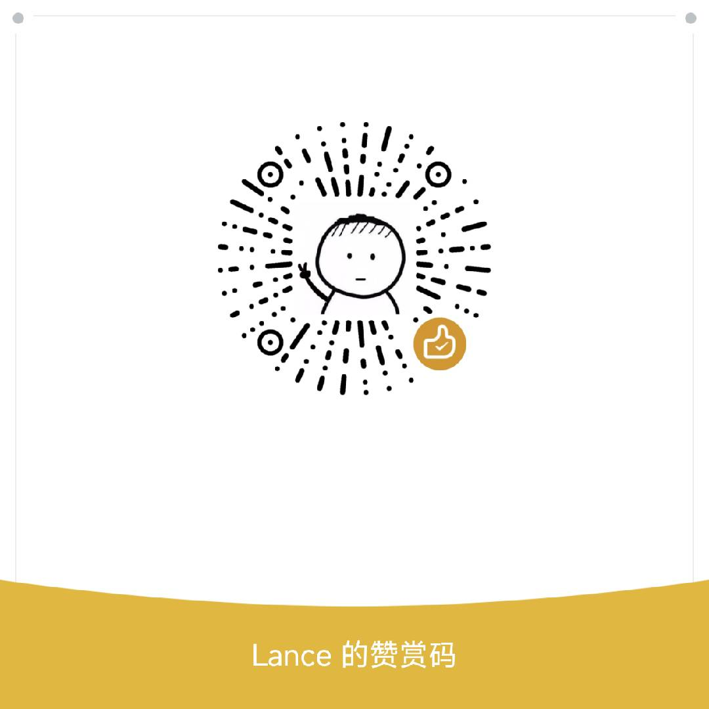

### ✨ 项目简介

本仓库为**纯公益开源项目**，完整整理收录倪海厦老师经典教学资源，包含全套高清教学视频、原版高清PDF讲义、配套课件与学习资料。全程无水印、无广告、无收费，旨在系统化、数字化传承传统中医与国学文化，为广大中医爱好者、自学从业者、传统文化学习者提供完整、规整、可便捷查阅的学习素材。

相较于零散的网络资源，本仓库对杂乱素材进行了**分类梳理、去重规整、统一命名、版本整合**，解决了原版资源分散、缺失、画质模糊、版本混乱等问题，适配零基础自学、系统进阶、资料存档查阅等多种使用场景。

### 📚 资源内容清单

仓库完整收录倪海厦核心全套体系资源，分类清晰、结构完整：

#### 1\. 人纪系列（中医核心必修）

- 针灸大成 完整教学视频 \+ 高清PDF讲义

- 神农本草经 完整教学视频\+ 高清PDF讲义

- 黄帝内经 完整教学视频 \+ 高清PDF讲义

- 伤寒论 完整教学视频 \+ 高清PDF讲义

- 金匮要略 完整教学视频 \+ 高清PDF讲义

#### 2\. 天纪系列（国学术数体系）

- 天纪完整课程PDF讲义、笔记、案例资料

#### 3\. 增补配套资料

- 各类辅助讲义、课堂笔记、知识点汇总文档

- 配套经典中医古籍电子版、拓展学习资料

- 资源纠错、补充更新文件，持续迭代完善

### 🔥 项目优势

- **全套整合**：一次性收录人纪、天纪核心全套资源，无需四处搜集，一站式获取

- **规整分类**：严格按照学习顺序分类归档，文件命名统一规范，查阅、下载、检索更高效

- **高清完整** ：筛选高清原版素材，剔除模糊、残缺、剪辑杂乱版本，资源完整性拉满

- **纯公益开源**：无版权商用用途，仅作传统文化学习、交流、存档使用，免费开放所有用户

- **持续更新**：后续会持续补充缺失资源、修正错误、增补学习笔记与拓展资料

### 📖 推荐自学顺序

适配零基础中医自学，遵循倪师官方教学逻辑：**针灸大成 → 神农本草经 → 黄帝内经 → 伤寒论 → 金匮要略 → 天纪拓展**，循序渐进，打好中医基础，建立完整辨证思维体系。

### ⚠️ 开源声明与使用须知

1\. 本仓库所有资源**仅用于个人学习、学术交流、传统文化传承**，禁止用于任何商业盈利、二次售卖、侵权传播等行为。

2\. 所有内容均为网络公开公益资源整理汇总，版权归原作者所有，本项目仅做整理归档、开源分享，不持有任何内容版权。

3\. 若涉及版权问题，请联系仓库维护者，将第一时间核查并删除对应内容。

4\. 学习内容仅作传统文化知识参考，不构成任何医疗建议，请勿直接自行用药、行医，临床诊疗请咨询专业医师。

### 🤝 贡献与协作

欢迎各位爱好者参与项目完善，欢迎 **Star、Fork、Pull Request**，可提交资源补全、内容纠错、笔记优化、分类优化等内容，共同维护优质开源中医学习资源库。

⭐ **Star 收藏**：持续更新不迷路，助力更多人学习正统中医国学文化

🍴 **Fork 分支**：自由备份、二次整理学习自用

### ☁️ 极速下载（百度网盘）

由于GitHub仓库单文件大小、存储容量有限，无法存放超大体积视频文件，因此将**全套高清视频、完整版PDF、配套笔记、合集资料**统一打包至百度网盘，方便批量保存、离线观看、永久归档。

**百度网盘链接**：长期有效，后续更新同步扩容

**获取方式**：Star本项目后，查看仓库置顶Issue获取最新网盘链接与提取码

💡 资源说明：全网规整最优版本，同步更新仓库增补资料，省心省力无需逐份搜集。

### 💖 支持我

如果您觉得这个项目整理的资料对您有帮助，愿意支持项目持续更新、资源迭代优化，欢迎扫描下方二维码进行捐赠，每一份支持都是持续更新的动力！

**捐赠二维码（支付宝）**

    

❤️ 随心捐赠、无关金额，万分感谢每一位支持者！
